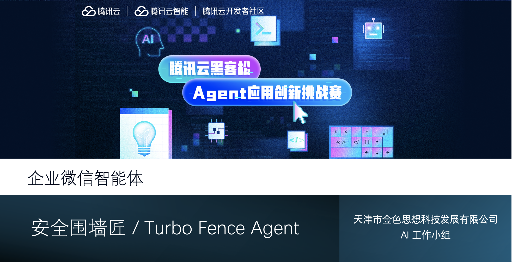
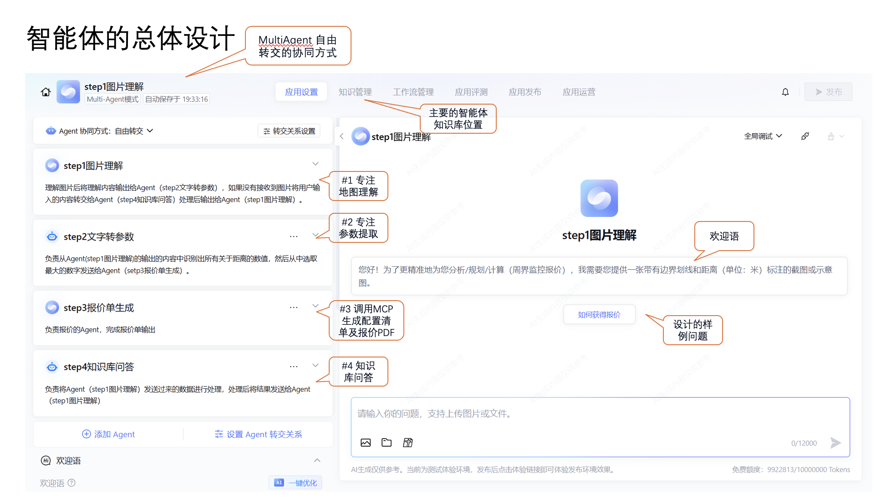
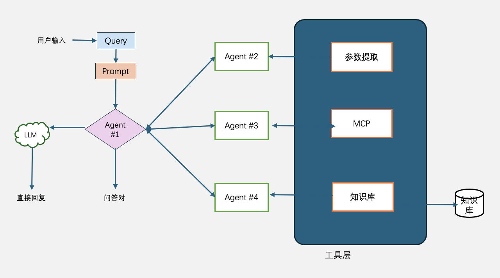

# TurbofenceAgent
周界安防设施规划和工程施工设备及材料清单出具、核算Agent，安防工程师助手。
# 介绍
本代码库是本案的mcp工具的代码实现，同时使用了腾讯ADP（腾讯云智能体开发平台），腾讯地图js sdk，共同作为智能体的实现。

## 核心框架
* FastAPI - 高性能的现代 Python API 框架，基于标准 Python 类型提示，自动生成 API 文档
* fastapi_mcp - 基于 FastAPI 的微服务框架，提供统一配置、依赖注入、模块化架构等增强功能

## 开发与部署工具
* uv
* Uvicorn
* docker compose
## 部署成果
* [这里](http://tencent.giit.cn:9099/mcp)
* 重新部署：sudo docker compose up --force-recreate --build -d

# 开发过程备忘
* 目前腾讯标准智能体无法有效控制流程的启动运行，同时单流程智能体没有提供图片上传入口。为完成本案功能，只能选择多智能体模式，但是多智能体模式精确度有限，导致本案功能不尽稳定, 略感遗憾！
* 本案虽已发布到企业微信机器人和微信服务号，但移动办公平台对接智能体也存障碍，如：企业微信机器人无法集成智能体的欢迎词和预设问题，微信服务号中无法展示超链接文字，移动端触控交互对于腾讯地图js sdk中测量功能支持不完善，导致手机中企业微信机器人中功能缺陷，生态衔接部分的缺位也降低了用户体验。
* Agent尤其是MultiAgent的工程化实现，需要精调的部分非常多，诸多不满意还需等待生态完善！

